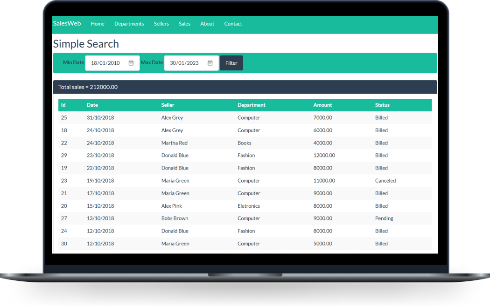

<h1 align="center">Sales Web</h1>

  <a href="#-projeto">Projeto</a>&nbsp;&nbsp;&nbsp;|&nbsp;&nbsp;&nbsp;
  <a href="#-tecnologias">Tecnologias</a>

 

  

## 💻 Projeto

Sistema CRUD de vendas, utilizando vendedores e departamentos com métodos de busca.

## 🚀 Tecnologias

Esse projeto foi desenvolvido com as seguintes tecnologias:

- [C#](https://learn.microsoft.com/en-us/dotnet/csharp/)
- [.NET](https://dotnet.microsoft.com/pt-br/)
- [ASP.NET Core](https://learn.microsoft.com/en-us/aspnet/core/?view=aspnetcore-7.0)
- [SQL Server](https://www.microsoft.com/en-us/sql-server/sql-server-downloads)
- [Bootstrap](https://getbootstrap.com/)

---
